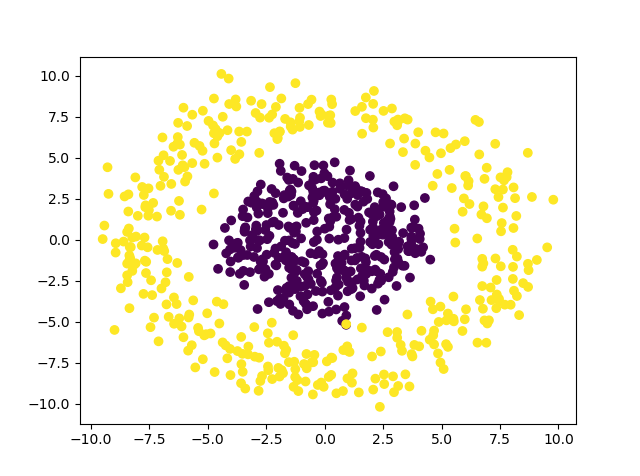

# Logistc Regression Examples
Logistic regression is used to evaluate the probability of a binary outcome using input variables. Due to its relative simplicity, logistic regression cannot classify a complex dataset. Here are examples of donut and XOR type data set, which cannot be classified with a simple logistic regression. To classify these data set, new calculated variables are needed. Radius r=sqrt(x1^2 + x2^2) is used for donut dataset and xy = X1 * X2 is used for the XOR type dataset.
### Donut dataset

### XOR type dataset

