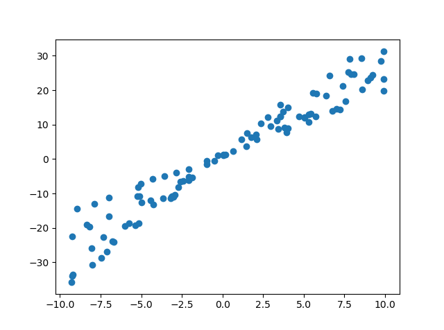
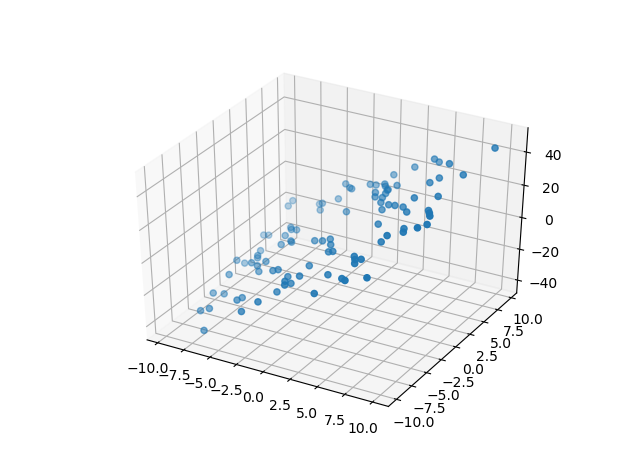
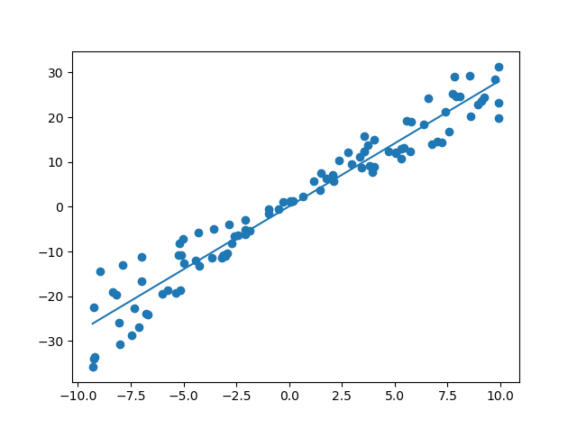
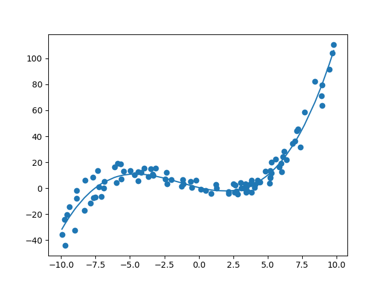
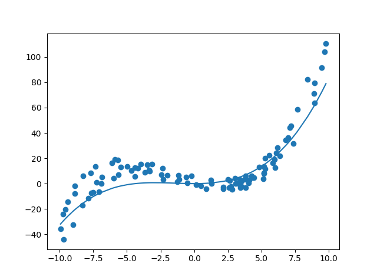

# Regression
The linear regression is coded with python using numpy vectors and matrices.

### Data Generator
Data_Generator.py generates data for linear regression for simple linear relationship (Linear.dat), exponential function (Exponential.dat), power function (Power.dat), log function (Log.dat), multi-variate linear (LinearMultiVar.dat), and polynomial (Poly.dat)

##### Linear Data
A generated data set with added random errors.

##### Linear Data for multi-variables (two variables)
A generated data Y = a + b1\*X1 + b2\*x2 with added random errors.

### Linear regression for a single variable
LinearRegressionMultiVariable.py performs linear regression for cases of a single independent variable (linear, exponential, power, and log data).

##### Linear Data and the fitted line

### Linear regression for multi-variables
LinearRegressionMultiVariable.py performs linear regression for multi-variate and polynomial cases.

### Polynomial regression using gradient descent and L1/L2 regulization
LR_With_L1_and_L2_Regularization_GradientDescent.py performs polynomial regression using gradient descent algorithm and L1 or L2 regulization. Increased L1 and L2 values make the fitted curve smoother (less complex).
##### Polynomial fitting without regularization
The fitted curve generally follows the data points.

##### Polynomial fitting with L2 regularization
The fitted curve becomes less complex compared with the case without regularization. L2 value is 50000.
